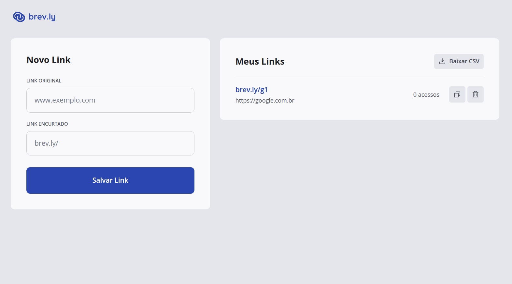

# brev-ly

**brev-ly** is a modern and efficient URL shortener developed with a full-stack architecture. It features a monorepo structure containing a Node.js backend and a React frontend.

## Key Features



- **URL Shortening:** Create short links with random or custom slugs.
- **Analytics:** Track visits to shortened links.
- **Management:** List, manage, and delete links.
- **Export:** Export link data to CSV using database cursors for memory-efficient processing, with the API streaming the output directly to Cloudflare R2.
- **API Documentation:** RESTful API documented with Swagger.

## Architecture

The project is organized as a monorepo:
- `server/`: Backend API (Node.js/Fastify)
- `web/`: Frontend Interface (React/Vite)

## Technology Stack

### Backend (`/server`)

- **Runtime & Framework:**
  - [Node.js](https://nodejs.org/) | [Fastify](https://www.fastify.io/) | [TypeScript](https://www.typescriptlang.org/)

- **Database & ORM:**
  - [PostgreSQL](https://www.postgresql.org/) | [Drizzle ORM](https://orm.drizzle.team/) | [Drizzle Kit](https://orm.drizzle.team/kit-docs/overview)

- **Validation & Documentation:**
  - [Zod](https://zod.dev/) | [Fastify Swagger](https://github.com/fastify/fastify-swagger)

- **Storage & Infrastructure:**
  - [AWS SDK S3](https://aws.amazon.com/sdk-for-javascript/) (Cloudflare R2 integration) | [Docker](https://www.docker.com/)

- **Tooling:**
  - [TSX](https://github.com/esbuild-kit/tsx) | [TSup](https://tsup.egoist.dev/) | [Biome](https://biomejs.dev/)

### Frontend (`/web`)

- **Core:**
  - [React](https://react.dev/) | [Vite](https://vitejs.dev/) | [TypeScript](https://www.typescriptlang.org/)

- **Routing & State:**
  - [TanStack Router](https://tanstack.com/router) | [TanStack Query](https://tanstack.com/query)

- **Styling:**
  - [Tailwind CSS](https://tailwindcss.com/) | [Tailwind Variants](https://www.tailwind-variants.org/)

- **UI Components & Utils:**
  - [React Hook Form](https://react-hook-form.com/) | [React Toastify](https://fkhadra.github.io/react-toastify/) | [Phosphor Icons](https://phosphoricons.com/)

### Package Management
- [pnpm](https://pnpm.io/)

## Setup and Execution Guide

### Prerequisites
- Node.js >= 18.x
- pnpm >= 10.x
- Docker & Docker Compose

### 1. Backend Setup (`/server`)

```bash
cd server
pnpm install

# Configure Environment
cp .env.example .env
# Edit .env with your credentials

# Start Database
docker-compose up -d db

# Run Migrations
pnpm db:generate
pnpm db:migrate

# Start Dev Server
pnpm dev
```
Server runs at `http://localhost:3333`. Swagger docs at [`/docs`](http://0.0.0.0:3333/docs).

### 2. Frontend Setup (`/web`)

```bash
cd web
pnpm install

# Configure Environment
cp .env.example .env

# Start Dev Server
pnpm dev
```
Frontend runs at `http://localhost:5173`.

### 3. Docker Execution (Full Stack)

To run the backend and database entirely in Docker:

```bash
# update the credentials in docker-compose.yml file
cd server
docker-compose up -d
```

## Available Scripts

### Backend
- `pnpm dev`: Development mode
- `pnpm build`: Build for production
- `pnpm start`: Start production build
- `pnpm db:studio`: Open Drizzle Studio

### Frontend
- `pnpm dev`: Development server
- `pnpm build`: Production build
- `pnpm preview`: Preview production build
- `pnpm lint`: Run ESLint
